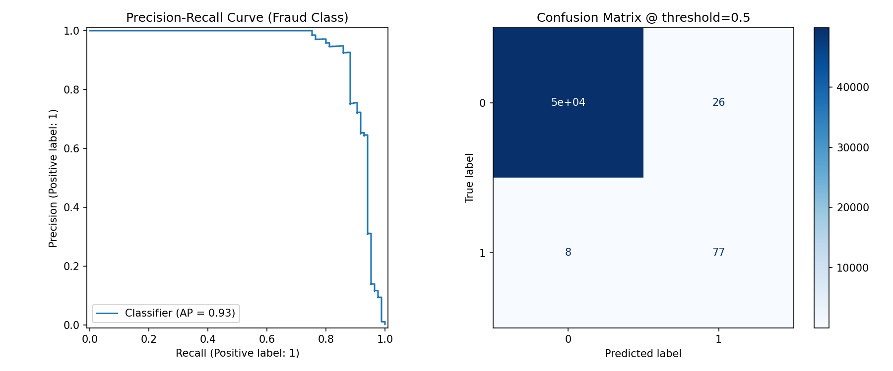

# Real-Time Credit Card Fraud Detection — End-to-End MLOps Pipeline

A production-style fraud detection system: synthetic transaction data generation →
feature engineering → imbalanced-classification model training → REST API serving →
Docker deployment → CI pipeline.

Built to demonstrate the full lifecycle a fraud/risk ML engineer owns in industry,
not just a notebook model.

## Results

Trained on 250,000 transactions with a realistic **0.17% fraud rate** (matching
real-world card-network fraud incidence), using a **time-based split** (no shuffling,
so no future-leaks-into-past) and **SMOTE** oversampling applied only to the training fold.

| Metric                            | Score     |
| --------------------------------- | --------- |
| PR-AUC (Average Precision)        | **~0.93** |
| ROC-AUC                           | ~0.99     |
| Precision (fraud class)           | ~0.85     |
| Recall (fraud class)              | ~0.88     |
| F1 (fraud class)                  | ~0.87     |
| Recall @ 85% precision constraint | ~88%      |

> These are representative results from `python src/train.py`. Because SMOTE's
> oversampling and XGBoost's tree construction involve randomness, exact
> numbers will vary by a few tenths of a percent between runs — that's
> expected, not a bug.

> Why PR-AUC, not just ROC-AUC: with ~0.17% positive rate, ROC-AUC stays
> misleadingly high even for a weak model. PR-AUC and precision/recall at a
> business-defined operating point are the metrics that matter for fraud review
> queues, where analyst capacity is the real constraint.



## Architecture

```
                    ┌──────────────────────┐
                    │  data/generate_data  │  synthetic transaction generator
                    │        .py           │  (0.17% fraud rate, realistic patterns)
                    └──────────┬───────────┘
                               ▼
                    ┌──────────────────────┐
                    │   src/features.py    │  sklearn-compatible transformer
                    │  (cyclical time,     │  (same code path train + serve —
                    │   customer behavior, │   no train/serve skew)
                    │   risk encoding)     │
                    └──────────┬───────────┘
                               ▼
                    ┌──────────────────────┐
                    │    src/train.py      │  time-split → SMOTE (train only)
                    │  XGBoost classifier  │  → XGBoost → threshold tuned to
                    │                      │   business precision constraint
                    └──────────┬───────────┘
                               ▼
              ┌────────────────┴─────────────────┐
              ▼                                  ▼
   ┌─────────────────────┐              ┌─────────────────────┐
   │   src/predict.py    │              │     api/main.py     │
   │  offline batch CLI  │              │  FastAPI real-time  │
   │  (scheduled jobs)   │              │  scoring service    │
   └─────────────────────┘              └──────────┬──────────┘
                                                     ▼
                                          ┌─────────────────────┐
                                          │  Docker / compose   │
                                          │  containerized      │
                                          │  deployment         │
                                          └─────────────────────┘
```

## Project structure

```
fraud-detection-mlops/
├── data/
│   └── generate_data.py       # synthetic data generator
├── src/
│   ├── features.py            # feature engineering transformer
│   ├── train.py                # training pipeline (SMOTE + XGBoost)
│   ├── evaluate.py             # PR curve / confusion matrix plots
│   └── predict.py              # offline batch scoring CLI
├── api/
│   ├── main.py                 # FastAPI service
│   └── schemas.py              # request/response models
├── models/                     # trained artifacts (generated)
├── tests/
│   ├── test_features.py
│   └── test_api.py
├── .github/workflows/ci.yml    # GitHub Actions CI
├── Dockerfile
├── docker-compose.yml
└── requirements.txt
```

## Design decisions

- **Time-based split, not random split.** Fraud patterns cluster in time
  (campaigns, stolen-card-batch usage). A random split leaks future information
  into training and inflates offline metrics relative to real deployment performance.
- **SMOTE only on the training fold.** Oversampling before splitting is a classic
  leakage bug — synthetic neighbors of test-set points would end up in training.
- **Threshold chosen by business constraint, not 0.5.** The deployed threshold
  maximizes recall subject to a minimum 85% precision, modeling a fraud-review
  team with limited daily investigation capacity.
- **Same feature transformer at train and serve time.** `FraudFeatureEngineer`
  is a single `sklearn`-compatible class imported by both the training script and
  the API, eliminating train/serve skew — a common source of silent production
  degradation.
- **Customer behavioral features** (`amount_vs_customer_avg`) proved to be
  high-signal: fraud often looks anomalous _relative to that customer's own
  history_, not in absolute terms.

## Notes on the dataset

This project uses a **synthetic dataset** generated to match the statistical
properties of real card-fraud data (severe class imbalance, night-time skew,
category risk skew, distance-from-home signal) rather than a proprietary or
license-restricted dataset.

## License

MIT — free to use and adapt for your own portfolio.
